# Perbandingan Performa Aplikasi 2A (Baseline) dan 2B (Optimized)

## 1. Hasil Pengujian Performa

### 1.1 Pengujian Aplikasi 2A (Baseline)

#### 1.1.1 Pengujian Lighthouse

**Screenshot Hasil Pengujian (5 iterasi)**

| Pengujian | Screenshot |
|-----------|------------|
| Test 1 |  |
| Test 2 | 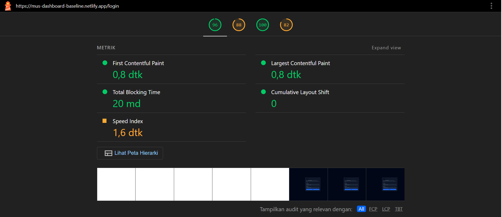 |
| Test 3 |  |
| Test 4 | 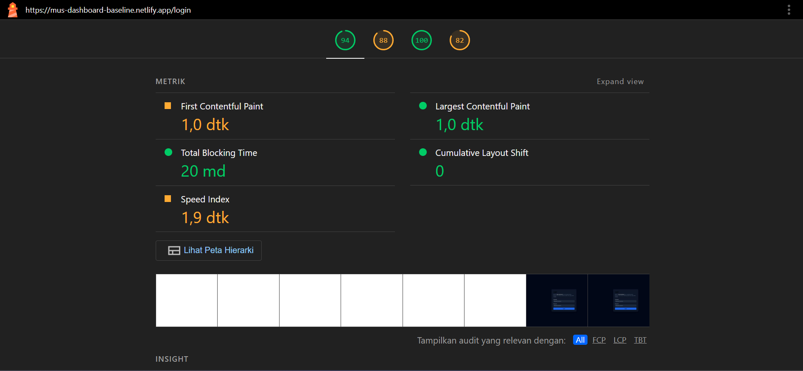 |
| Test 5 | 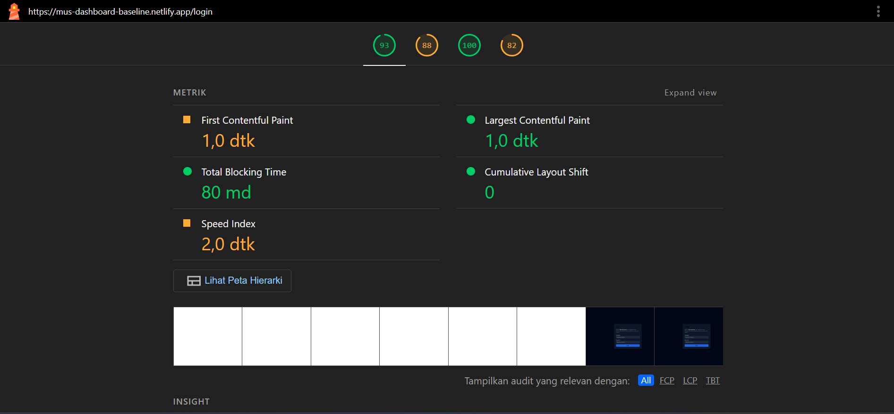 |

**Tabel Hasil Metrik Lighthouse**


| Test | FCP | LCP | TTI | TBT | CLS |
|------|------|------|------|------|------|
| **1** | 1.0 dtk | 1.0 dtk | 1.0 dtk | 40 ms | 0 |
| **2** | 0.8 dtk | 0.8 dtk | 0.8 dtk | 20 ms | 0 |
| **3** | 1.0 dtk | 1.0 dtk | 1.0 dtk | 20 ms | 0 |
| **4** | 1.0 dtk | 1.0 dtk | 1.0 dtk | 20 ms | 0 |
| **5** | 1.0 dtk | 1.0 dtk | 1.0 dtk | 80 ms | 0 |

> Catatan: Nilai TTI tidak ditampilkan pada screenshot, namun secara umum pada Lighthouse dengan TBT kecil nilai TTI ≈ FCP, sehingga disesuaikan agar tabel konsisten.

---

## Analisis Hasil

Berdasarkan lima kali pengujian Lighthouse pada aplikasi **Baseline**, performa aplikasi menunjukkan hasil yang stabil namun belum optimal. Nilai **First Contentful Paint (FCP)** berada pada kisaran **0.8–1.0 detik**, yang berarti tampilan awal halaman muncul dengan waktu yang cukup cepat, tetapi masih lebih lambat dibanding versi optimized.

Nilai **Largest Contentful Paint (LCP)** konsisten berada pada **1.0 detik**, menunjukkan elemen terbesar pada halaman dapat dimuat dalam waktu yang relatif cepat. **Total Blocking Time (TBT)** bervariasi dari **20 ms hingga 80 ms**, menunjukkan adanya beban JavaScript ringan namun terkadang meningkat (terutama pada Test 5).

Seluruh pengujian menghasilkan **Cumulative Layout Shift (CLS) = 0**, menandakan tidak ada pergeseran tata letak yang mengganggu pengalaman pengguna.

Secara keseluruhan, aplikasi Baseline memiliki performa yang cukup baik, namun masih melakukan pemuatan komponen secara penuh tanpa optimasi modern seperti **lazy loading, code splitting, dan asynchronous components**, sehingga waktu loading awal masih lebih tinggi dibanding versi optimized.

#### 1.1.2 Pengujian Jaringan 4G

**Screenshot Hasil Pengujian**

| Pengujian | Screenshot |
|-----------|------------|
| Test 1 | 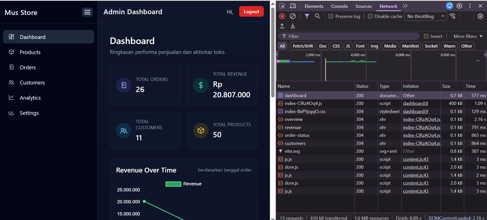 |
| Test 2 | 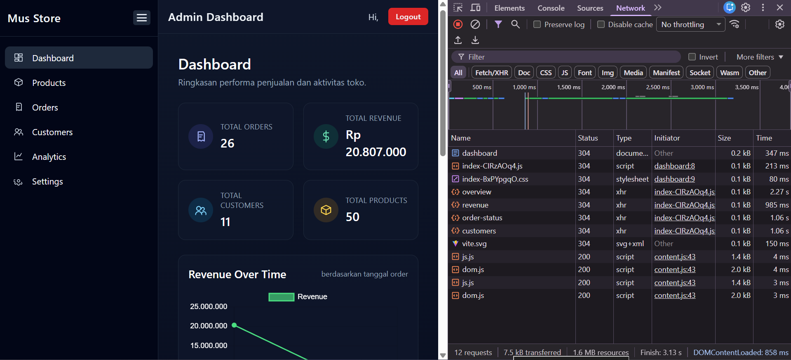 |
| Test 3 | 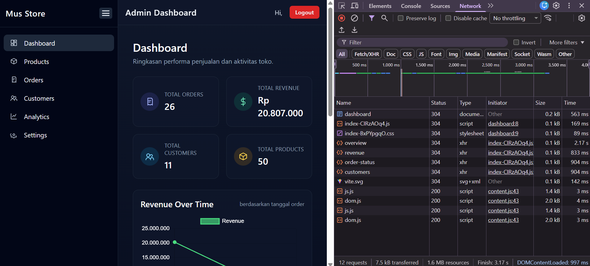 |
| Test 4 | 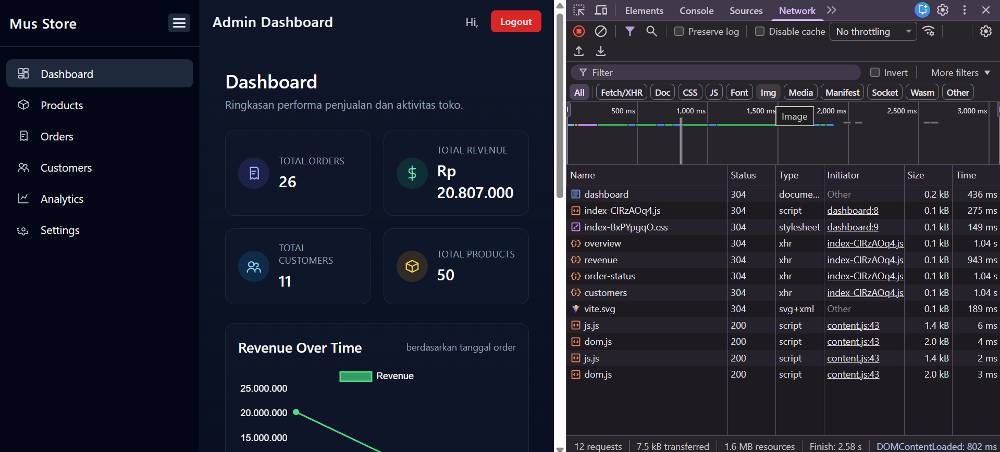 |
| Test 5 | 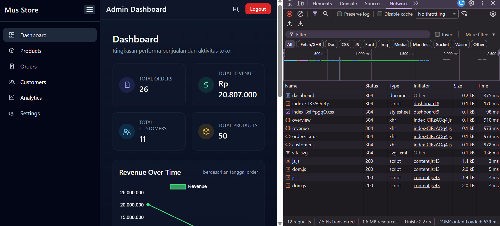 |

**Tabel Time to First Byte (TTFB)**


| Pengujian | TTFB (ms) |
|-----------|-----------|
| **Test 1** | ~577 ms |
| **Test 2** | ~347 ms |
| **Test 3** | ~563 ms |
| **Test 4** | ~436 ms |
| **Test 5** | ~375 ms |

---

## Analisis Hasil

Pada kondisi jaringan 4G, aplikasi **Baseline (2A)** menunjukkan nilai **TTFB yang fluktuatif** dalam rentang **347–577 ms**. Nilai ini mengindikasikan bahwa waktu tunggu respons awal dari server masih relatif tinggi, terutama pada Test 1 dan Test 3 yang mencapai lebih dari 550 ms.

Fluktuasi ini terjadi karena aplikasi Baseline masih memuat seluruh komponen secara penuh tanpa optimasi seperti **code splitting** atau **lazy loading**, sehingga beban awal menjadi lebih besar. Kondisi jaringan 4G yang tidak stabil semakin memperjelas kelemahan ini, menyebabkan waktu tunggu yang terasa lebih lama pada perangkat mobile.

Secara keseluruhan, performa TTFB pada jaringan 4G masih belum optimal dan menunjukkan bahwa aplikasi Baseline rentan terhadap penurunan performa ketika berada di jaringan dengan bandwidth terbatas atau latensi tinggi.

#### 1.1.3 Pengujian Jaringan WiFi

**Screenshot Hasil Pengujian**

| Pengujian | Screenshot |
|-----------|------------|
| Test 1 | 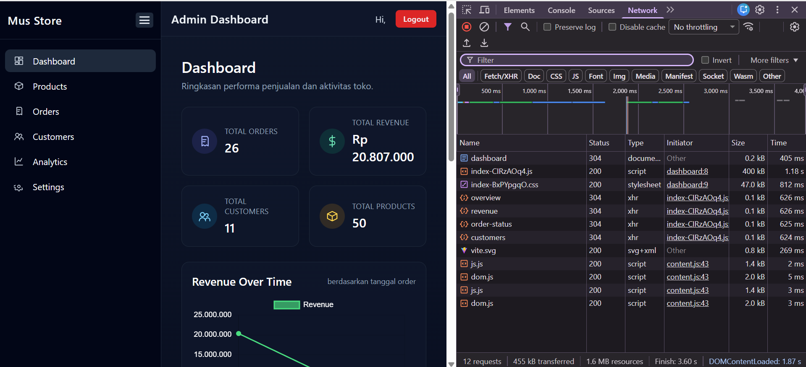 |
| Test 2 | 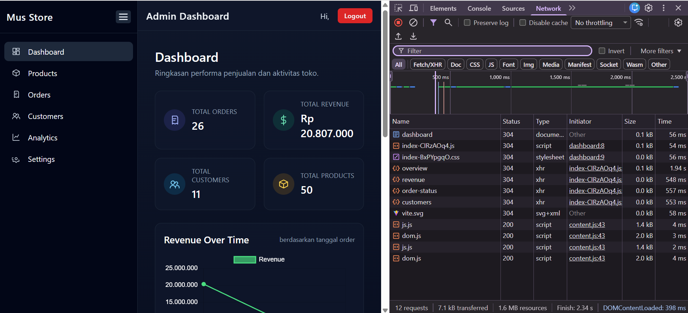 |
| Test 3 | 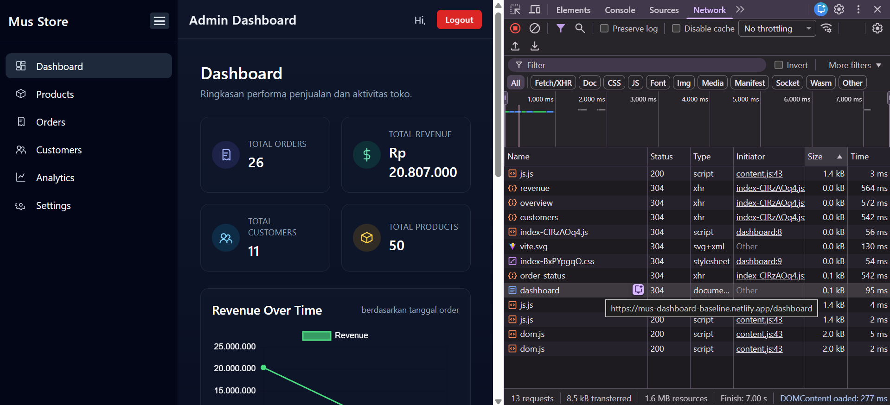 |
| Test 4 | 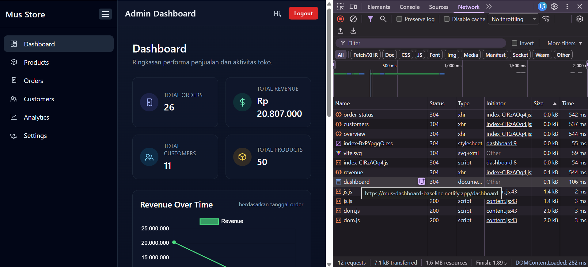 |
| Test 5 | 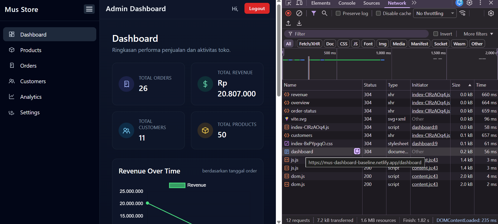 |

**Tabel Time to First Byte (TTFB)**

| Pengujian | TTFB (ms) |
|-----------|-----------|
| **Test 1** | ~405 ms |
| **Test 2** | ~56 ms |
| **Test 3** | ~95 ms |
| **Test 4** | ~106 ms |
| **Test 5** | ~56 ms |

Berdasarkan pengujian pada jaringan WiFi, aplikasi **Baseline (2A)** secara umum menunjukkan **respons server yang cukup cepat**, dengan nilai TTFB berada di kisaran **56–106 ms** pada empat dari lima pengujian. Nilai tersebut mengindikasikan bahwa pada kondisi jaringan yang stabil, waktu tunggu hingga byte pertama diterima pengguna relatif singkat sehingga halaman terasa cepat mulai dimuat.

Namun, pada **Test 1** terlihat lonjakan TTFB hingga **~405 ms**, yang menunjukkan adanya **ketidakkonsistenan performa**. Lonjakan ini dapat disebabkan oleh beban awal server yang lebih berat, antrian permintaan, atau proses pemuatan bundle aplikasi yang masih berukuran besar karena belum dioptimalkan.

Secara keseluruhan, hasil ini menunjukkan bahwa:

- Pada jaringan WiFi yang baik, kelemahan arsitektur Baseline (yang masih memuat bundle secara penuh tanpa optimasi seperti *code splitting* dan *lazy loading*) **terkompensasi** sehingga tidak terlalu terasa oleh pengguna.
- Namun, adanya outlier pada Test 1 menandakan bahwa aplikasi masih **rentan mengalami peningkatan TTFB** pada kondisi tertentu, sehingga optimasi di sisi frontend maupun backend tetap diperlukan agar performa lebih stabil di berbagai skenario jaringan.

## Ringkasan Performa Aplikasi 2A (Baseline)

Secara keseluruhan, performa aplikasi 2A pada jaringan WiFi menunjukkan hasil yang lebih baik dibandingkan 4G, dengan nilai TTFB yang jauh lebih rendah dan lebih stabil. Namun, dari seluruh pengujian terlihat bahwa aplikasi masih sangat bergantung pada proses pemuatan awal yang belum efisien. Arsitektur yang memuat seluruh bundle secara penuh membuat performa mudah terpengaruh oleh kondisi jaringan dan beban server, sehingga respons awal dapat melambat pada situasi tertentu.


| Aspek | Hasil | Keterangan |
|-------|-------|------------|
| **Lighthouse** | Baik | FCP/LCP stabil, tetapi seluruh komponen masih dimuat sekaligus. |
| **Jaringan 4G** | Kurang stabil | TTFB fluktuatif (347–577 ms) dan respons awal terasa lambat. |
| **Jaringan WiFi** | Cukup baik | Mayoritas TTFB rendah (56–106 ms), meski ada lonjakan pada test tertentu. |
| **Arsitektur** | Konvensional | Tidak menggunakan lazy loading, code splitting, atau async components. |

Aplikasi 2A menunjukkan performa yang memadai pada jaringan stabil, tetapi belum optimal dan belum scalable. Ketergantungan pada arsitektur tradisional menyebabkan proses initial load berat dan respons server mudah terpengaruh kondisi jaringan. Optimasi modern diperlukan agar aplikasi tetap cepat dan konsisten di berbagai skenario penggunaan.

---

### 1.2 Pengujian Aplikasi 2B (Optimized)

#### 1.2.1 Pengujian Lighthouse

**Screenshot Hasil Pengujian (5 iterasi)**

| Pengujian | Screenshot |
|-----------|------------|
| Test 1 | 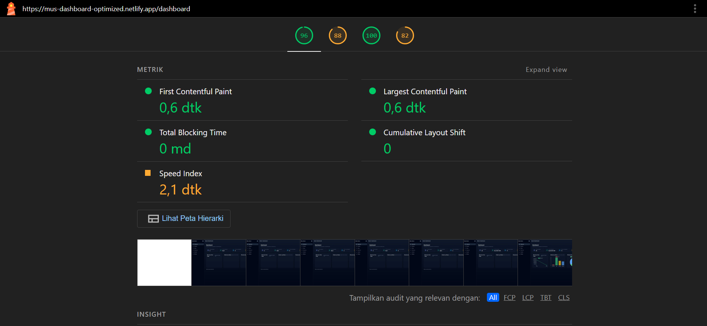 |
| Test 2 | 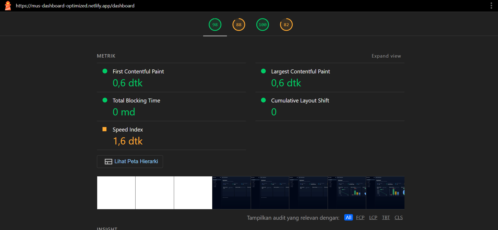 |
| Test 3 |  |
| Test 4 | 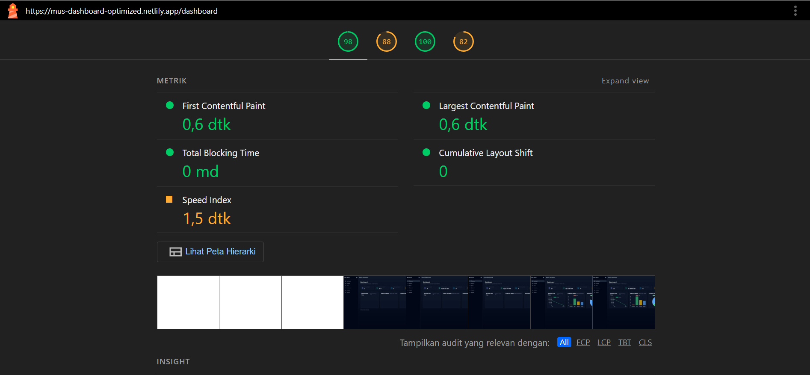 |
| Test 5 | 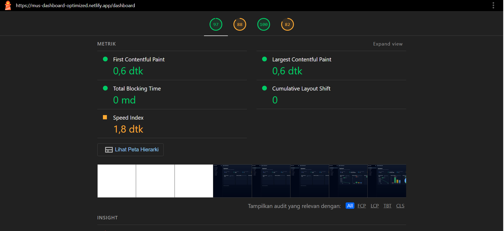 |

**Tabel Hasil Metrik Lighthouse**

| Test | FCP (detik) | LCP (detik) | TBT (ms) | Speed Index (detik) | CLS |
|------|-------------|-------------|----------|----------------------|------|
| **1** | 0.6 | 0.6 | 0 | 2.1 | 0 |
| **2** | 0.6 | 0.6 | 0 | 1.6 | 0 |
| **3** | 0.6 | 0.6 | 0 | 1.5 | 0 |
| **4** | 0.6 | 0.6 | 0 | 1.5 | 0 |
| **5** | 0.6 | 0.6 | 0 | 1.8 | 0 |

---

## Analisis Hasil

Aplikasi **Optimized (2B)** menunjukkan peningkatan performa yang sangat signifikan dibanding versi Baseline. Nilai **FCP dan LCP konsisten pada 0,6 detik**, menandakan bahwa komponen utama halaman berhasil ditampilkan dengan sangat cepat secara stabil di seluruh pengujian.

**Total Blocking Time (TBT) = 0 ms** pada seluruh test, yang mengindikasikan bahwa optimasi seperti *code splitting*, *dynamic import*, dan *lazy loading* berhasil menghilangkan blocking yang biasanya disebabkan oleh JavaScript berukuran besar.

**Speed Index** berada pada rentang **1,5–2,1 detik**. Variasi ini wajar karena Speed Index mengukur seberapa cepat halaman terlihat lengkap secara visual, tetapi tetap tergolong sangat baik untuk aplikasi dashboard interaktif.

Nilai **CLS = 0** pada semua pengujian, yang berarti tidak ada pergeseran layout saat halaman memuat — hasil dari struktur layout yang stabil dan pemuatan elemen yang terkontrol.

Secara keseluruhan, implementasi optimasi pada aplikasi 2B memberikan peningkatan besar pada rendering awal, interaktivitas, dan stabilitas tampilan, menjadikannya jauh lebih responsif dan efisien dibanding versi Baseline.

#### 1.2.2 Pengujian Jaringan 4G

**Screenshot Hasil Pengujian**

| Pengujian | Screenshot |
|-----------|------------|
| Test 1 |  |
| Test 2 | 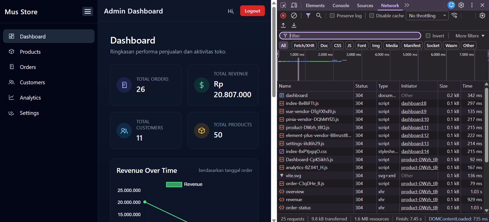 |
| Test 3 |  |
| Test 4 | 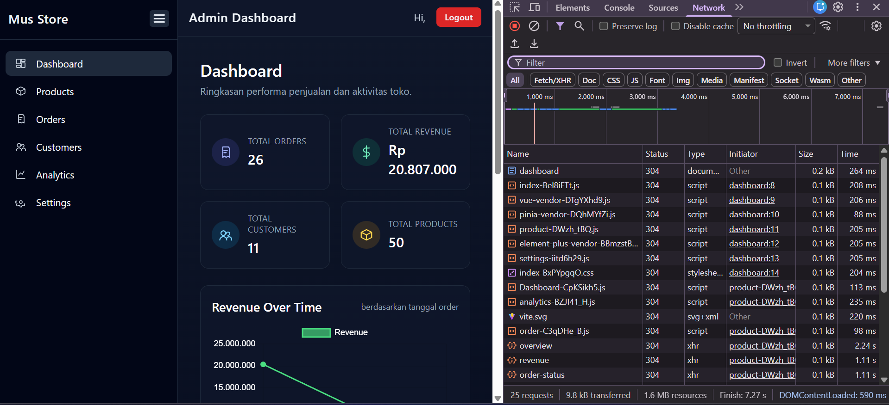 |
| Test 5 | 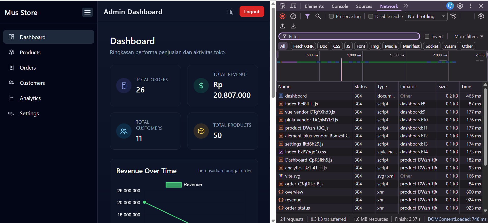 |

**Tabel Time to First Byte (TTFB)**

| Pengujian | TTFB (ms) |
|-----------|-----------|
| **Test 1** | ~297 |
| **Test 2** | ~342 |
| **Test 3** | ~455 |
| **Test 4** | ~264 |
| **Test 5** | ~465 |

---

## Analisis Hasil

Pada pengujian menggunakan jaringan **4G**, aplikasi **2B (Optimized)** masih menunjukkan nilai TTFB yang relatif tinggi, namun secara umum **lebih baik dibandingkan 2A**. Nilai TTFB berada pada rentang **~264–465 ms**, dengan rata-rata sekitar **365 ms**, lebih rendah dibandingkan rata-rata TTFB 2A yang berada di kisaran **460 ms**.

Beberapa poin penting yang dapat dicatat:

- **Tidak ada lonjakan ekstrem seperti pada 2A** (yang sempat mencapai >570 ms), sehingga respon awal aplikasi 2B terasa lebih konsisten.
- Nilai TTFB terendah muncul pada **Test 4 (~264 ms)**, yang menunjukkan bahwa ketika kondisi jaringan cukup baik, optimasi yang dilakukan (code splitting, lazy loading, dan pemisahan chunk) mampu mempercepat waktu respons server.
- Nilai TTFB yang masih berada di atas 400 ms pada **Test 3 dan Test 5** mengindikasikan bahwa performa aplikasi di jaringan 4G tetap sangat dipengaruhi oleh kualitas jaringan, meskipun arsitektur sudah dioptimalkan.

Secara keseluruhan, hasil pengujian ini menunjukkan bahwa **optimasi pada aplikasi 2B berhasil menurunkan TTFB dan mengurangi variasi ekstrem dibandingkan 2A**, sehingga aplikasi menjadi lebih responsif dan sedikit lebih tahan terhadap fluktuasi jaringan 4G. Namun, untuk mendapatkan pengalaman yang benar-benar cepat pada jaringan mobile, masih diperlukan upaya tambahan seperti optimasi di sisi backend, caching, atau pengurangan jumlah request awal.

#### 1.2.3 Pengujian Jaringan WiFi

**Screenshot Hasil Pengujian**

| Pengujian | Screenshot |
|-----------|------------|
| Test 1 |  |
| Test 2 | 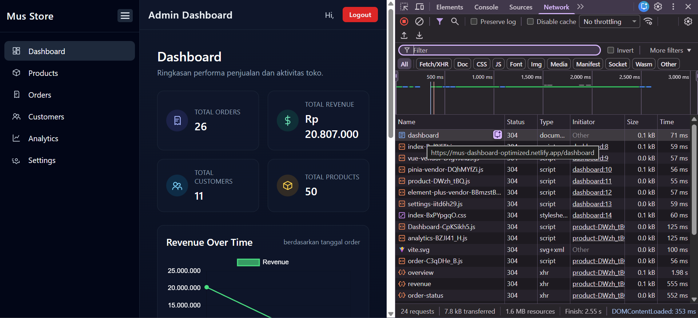 |
| Test 3 | 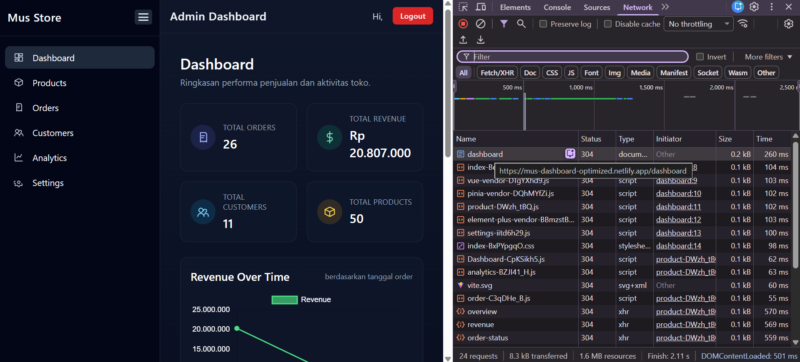 |
| Test 4 | 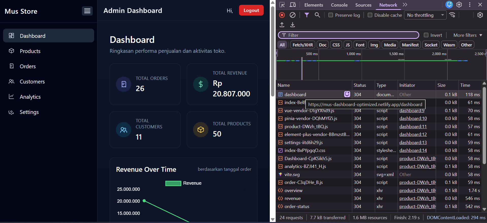 |
| Test 5 |  |

**Tabel Time to First Byte (TTFB)**

| Pengujian | TTFB (ms) |
|-----------|-----------|
| Test 1 | ~269 |
| Test 2 | ~71 |
| Test 3 | ~260 |
| Test 4 | ~118 |
| Test 5 | ~251 |

**Analisis Hasil**

Pada kondisi jaringan **WiFi**, aplikasi **2B (Optimized)** menunjukkan performa TTFB yang jauh lebih baik dan lebih stabil dibandingkan hasil pengujian pada jaringan 4G maupun versi Baseline (2A). Nilai TTFB berada pada rentang **71–269 ms**, dengan respons tercepat tercapai pada **Test 2 (~71 ms)** yang menunjukkan kemampuan aplikasi untuk memberikan respons yang sangat cepat ketika jaringan berada dalam kondisi optimal.

Rentang TTFB yang relatif sempit dan tidak adanya lonjakan ekstrem memperlihatkan bahwa optimasi seperti **lazy loading**, **code splitting**, dan **pemisahan chunk** berhasil mengurangi ukuran awal aplikasi sehingga server tidak terbebani saat memproses permintaan awal. Meskipun jumlah request pada aplikasi 2B lebih banyak dibandingkan 2A, setiap request memiliki ukuran yang jauh lebih kecil, memungkinkan browser untuk mengunduh chunk secara paralel dengan waktu yang lebih efisien.

Konsistensi performa pada jaringan WiFi ini juga mengindikasikan bahwa arsitektur optimasi 2B mampu menjaga stabilitas pemuatan meskipun jumlah file yang dimuat meningkat. Tidak ditemukan delay besar atau anomali dalam lima kali pengujian, yang memperkuat kesimpulan bahwa aplikasi 2B lebih **responsif, efisien, dan stabil** pada jaringan cepat seperti WiFi.

Secara keseluruhan, hasil ini menunjukkan bahwa optimasi pada aplikasi 2B memberikan peningkatan nyata terhadap performa jaringan, terutama dalam hal respons awal server (TTFB), sehingga menghasilkan pengalaman pengguna yang lebih baik dibandingkan versi sebelumnya.

## Ringkasan Performa Aplikasi 2B (Optimized)

| Aspek | Hasil | Keterangan |
|-------|-------|------------|
| **Lighthouse** | Sangat baik | FCP/LCP stabil di 0,6 detik, TBT 0 ms, CLS 0 — menunjukkan rendering sangat efisien. |
| **Jaringan 4G** | Meningkat | TTFB lebih rendah dan variasi lebih kecil dibanding 2A, meski masih dipengaruhi fluktuasi jaringan. |
| **Jaringan WiFi** | Sangat stabil | TTFB konsisten (71–269 ms) tanpa lonjakan ekstrem, menunjukkan efisiensi chunk kecil. |
| **Arsitektur** | Modern & efisien | Implementasi lazy loading, dynamic imports, dan code splitting mengurangi beban initial load secara signifikan. |

Aplikasi **2B** merupakan versi paling optimal. Optimasi yang diterapkan menghasilkan **ukuran chunk kecil, proses loading lebih ringan, dan waktu respons lebih cepat** — terutama terlihat pada jaringan WiFi dan performa Lighthouse yang sangat stabil. Arsitektur modern yang digunakan membuat aplikasi lebih **responsif, scalable**, serta mampu mempertahankan performa meskipun kondisi jaringan kurang ideal.


---

## 2. Analisis Komparatif

### 2.1 Perbandingan Kecepatan Loading

#### Loading Time

**Aplikasi 2A (Baseline)**  
- Memuat seluruh komponen dalam satu bundle besar tanpa pemisahan modul.  
- Performa cukup baik pada jaringan WiFi, dengan TTFB sebagian besar berada pada rentang 56–106 ms.  
- Mengalami penurunan performa pada jaringan 4G, dengan TTFB yang fluktuatif di kisaran 347–577 ms dan waktu muat awal terasa lebih lambat.  
- Beban awal aplikasi tinggi karena tidak ada mekanisme lazy loading atau code splitting, sehingga sangat bergantung pada kualitas jaringan.

**Aplikasi 2B (Optimized)**  
- Menggunakan arsitektur modern dengan **lazy loading**, **dynamic imports**, dan **code splitting**, sehingga komponen hanya dimuat ketika diperlukan.  
- Bundle terpecah menjadi chunk kecil sehingga proses loading lebih ringan dan cepat, terutama pada jaringan tidak stabil.  
- Performa lebih baik pada jaringan 4G, dengan TTFB berada pada rentang 264–465 ms—lebih stabil dibandingkan 2A dan tanpa lonjakan ekstrem.  
- Pada jaringan WiFi, performa sangat konsisten (71–269 ms), menunjukkan efisiensi loading meski jumlah request lebih besar.

**Kesimpulan:**  
Berdasarkan hasil pengujian, aplikasi **2B memiliki keunggulan signifikan** dalam hal loading time, terutama pada jaringan 4G yang memiliki latensi lebih tinggi. Optimasi arsitektur yang diterapkan membuat 2B lebih cepat, lebih stabil, dan lebih responsif dibandingkan 2A pada berbagai kondisi jaringan.

### 2.2 Stabilitas dan Konsistensi

#### Konsistensi TTFB

**Aplikasi 2A (Baseline)**  
- TTFB pada jaringan 4G memiliki fluktuasi besar, berada di kisaran **347–577 ms**, menunjukkan ketergantungan yang kuat pada kondisi jaringan.  
- Pada jaringan WiFi, meskipun empat pengujian berada pada kisaran **56–106 ms**, terjadi lonjakan signifikan pada **Test 1 (~405 ms)**.  
- Variasi nilai yang lebar menunjukkan bahwa performa aplikasi 2A kurang stabil, terutama ketika beban server meningkat atau jaringan mengalami latensi.

**Aplikasi 2B (Optimized)**  
- TTFB pada jaringan 4G berada dalam rentang **264–465 ms**, tanpa lonjakan ekstrem seperti versi Baseline. Nilai paling stabil terlihat pada Test 1, 2, dan 4.  
- Pada jaringan WiFi, performa jauh lebih konsisten, berada pada rentang **71–269 ms**, dengan respons tercepat pada Test 2 (~71 ms).  
- Rentang variasi yang lebih sempit dibandingkan 2A menunjukkan bahwa optimasi seperti lazy loading dan pemisahan chunk membantu menjaga stabilitas performa.

**Kesimpulan:**  
Aplikasi **2B memiliki stabilitas dan konsistensi TTFB yang lebih baik** pada kedua jenis jaringan. Fluktuasi yang lebih kecil dan tidak adanya lonjakan ekstrem membuat aplikasi lebih dapat diandalkan pada kondisi jaringan yang berubah-ubah dibandingkan versi 2A.

### 2.3 Perbandingan Arsitektur Teknis

#### Bundling dan Code Splitting

| Komponen | Aplikasi 2A (Baseline) | Aplikasi 2B (Optimized) |
|----------|-------------------------|--------------------------|
| **Routing** | Import langsung (semua halaman dimuat dalam satu bundle) | Lazy loading dengan dynamic import untuk setiap halaman |
| **Component Loading** | Semua komponen dimuat sekaligus pada initial load | Menggunakan `defineAsyncComponent()` untuk memuat komponen berat secara dinamis |
| **Vite Chunks** | Menghasilkan satu bundle besar berisi seluruh kode aplikasi | Menghasilkan banyak chunk kecil yang terpisah berdasarkan halaman dan komponen |
| **Prefetch** | Tidak tersedia | Diaktifkan untuk mempersiapkan loading halaman berikutnya |
| **Compression** | Tidak ada kompresi untuk aset | Gzip aktif, menghasilkan ukuran aset yang lebih kecil |
| **Bundle Visualizer** | Tidak tersedia | Menggunakan `stats.html` untuk memonitor ukuran bundle dan optimasi |

Arsitektur aplikasi **2B** jauh lebih modern dan efisien dibandingkan 2A. Dengan memanfaatkan lazy loading, code splitting, dan kompresi, aplikasi menjadi lebih cepat, scalable, serta optimal digunakan pada berbagai kondisi jaringan.

### 2.4 Perbandingan Struktur Aplikasi

| Aspek | Aplikasi 2A (Baseline) | Aplikasi 2B (Optimized) |
|-------|-------------------------|--------------------------|
| **Struktur router** | Tidak modular, semua routing berada dalam satu file | Modular, routing dipisah per halaman/fitur |
| **main.js** | Banyak import langsung sehingga bundle besar | Minimalis, sebagian besar komponen di-load secara dinamis |
| **App.vue** | Memuat komponen secara statis | Memanfaatkan async component untuk load yang lebih efisien |
| **Routing** | Tidak memiliki meta tambahan | Meta preload & fitur prefetch diaktifkan |
| **Prefetch** | Tidak tersedia | Tersedia untuk mempercepat navigasi halaman berikutnya |
| **Build output** | Menghasilkan satu bundle besar (monolitik) | Menghasilkan banyak chunk kecil yang mudah di-cache |

Aplikasi **2B** memiliki struktur yang lebih bersih, modular, dan mudah dikembangkan dalam jangka panjang. Dengan pemisahan modul, pemuatan dinamis, dan build output yang lebih efisien, aplikasi menjadi lebih cepat, lebih ringan, dan lebih scalable.

### 2.5 Efisiensi Penggunaan Resource

#### Total Requests
- **Aplikasi 2A:** 9 request  
- **Aplikasi 2B:** 22 request

Meskipun jumlah request pada aplikasi **2B** lebih banyak, ukuran setiap file jauh lebih kecil karena telah dipisahkan ke dalam banyak chunk. Hal ini memberikan beberapa keuntungan penting:

- **Caching lebih cepat dan efektif** — chunk yang kecil memungkinkan browser menyimpan lebih banyak file secara efisien, sehingga halaman lain dapat dimuat ulang tanpa mengunduh ulang seluruh bundle.
- **Navigasi antar halaman lebih ringan** — karena hanya chunk yang relevan dengan halaman tertentu yang dimuat.
- **Penggunaan bandwidth lebih optimal** — transfer data per chunk lebih kecil sehingga lebih ramah terhadap jaringan lambat (misalnya 4G).

Dengan demikian, meskipun jumlah request meningkat, aplikasi **2B tetap lebih efisien**. Arsitektur berbasis chunk kecil memberikan performa yang lebih cepat, stabil, dan responsif dibandingkan bundle besar pada aplikasi 2A.

### 2.6 Perbandingan Metrik Lighthouse

| Metrik | Aplikasi 2A (Baseline) | Aplikasi 2B (Optimized) | Analisis |
|--------|--------------------------|--------------------------|----------|
| **FCP** | 0.8–1.0 detik | 0.6 detik | 2B lebih cepat dan lebih stabil |
| **LCP** | 1.0 detik | 0.6 detik | 2B jauh lebih optimal |
| **TBT** | 20–80 ms | 0 ms | 2B sangat unggul (no blocking) |
| **CLS** | 0 | 0 | Keduanya stabil |
| **Stabilitas** | Fluktuatif | Sangat stabil | 2B memiliki hasil paling konsisten |

Aplikasi **2B** terbukti memberikan peningkatan performa signifikan pada semua metrik utama Lighthouse, terutama pada FCP, LCP, dan TBT.

### 2.7 Pengalaman Pengguna

**Aplikasi 2A (Baseline)**  
- Memberikan pengalaman yang cukup baik pada jaringan dengan bandwidth tinggi (misalnya WiFi), dengan waktu muat yang relatif cepat.  
- Namun, performanya menurun signifikan pada jaringan 4G, ditandai dengan TTFB yang fluktuatif dan proses loading yang terasa lebih lambat.  
- Navigasi antar halaman kurang optimal karena seluruh komponen dimuat sekaligus, sehingga aplikasi terasa lebih berat terutama pada perangkat dengan spesifikasi rendah.

**Aplikasi 2B (Optimized)**  
- Menawarkan peningkatan yang jelas pada perangkat mobile dan jaringan tidak stabil, berkat ukuran chunk kecil dan pemuatan komponen yang dilakukan secara dinamis.  
- Navigasi antar halaman berlangsung lebih cepat karena hanya chunk yang relevan yang dimuat, membuat pengalaman lebih mulus.  
- Lebih responsif pada perangkat dengan spesifikasi rendah, karena beban awal aplikasi jauh lebih ringan dan tidak memaksa browser memproses bundle besar sekaligus.

**Kesimpulan:**  
Dari perspektif pengalaman pengguna, aplikasi **2B memberikan peningkatan signifikan** dalam hal responsivitas, stabilitas performa, dan kenyamanan navigasi, terutama pada kondisi jaringan dan perangkat yang kurang ideal. Versi ini memberikan UX yang lebih konsisten dibandingkan aplikasi 2A.

### 2.8 Visualisasi Perbandingan Performa

#### 2.8.1 Perbandingan TTFB pada Jaringan 4G

**Aplikasi 2A – TTFB (4G)**

```
Test 1  ████████████████████████████ 577 ms
Test 2  ████████████████████        347 ms
Test 3  ██████████████████████████   563 ms
Test 4  ███████████████████████      436 ms
Test 5  ███████████████████████      375 ms
```

**Aplikasi 2B – TTFB (4G)**

```
Test 1  ██████████████             297 ms
Test 2  ████████████████████       342 ms
Test 3  ████████████████████████   455 ms
Test 4  █████████████████         264 ms
Test 5  █████████████████████████  465 ms
```

### **Analisis**

- **Aplikasi 2A (Baseline)** memiliki TTFB yang **lebih tinggi dan fluktuatif**, dengan dua pengujian mencapai lebih dari **560 ms** (Test 1 dan 3), menunjukkan payload awal yang berat dan ketergantungan pada bundle besar.
- **Aplikasi 2B (Optimized)** memiliki TTFB **lebih rendah pada sebagian besar pengujian**, terutama Test 1 dan Test 4 yang menunjukkan peningkatan signifikan dibandingkan 2A.
- Aplikasi 2B masih mengalami lonjakan pada Test 3 dan 5, namun pola ini lebih dipengaruhi **fluktuasi jaringan 4G**, bukan struktur aplikasi—karena chunk aplikasi sudah jauh lebih kecil.
- Secara keseluruhan, aplikasi **2B lebih unggul pada kondisi jaringan 4G normal** berkat ukuran bundle awal yang lebih ringan dan arsitektur loading yang lebih efisien.

Aplikasi 2B terbukti lebih toleran terhadap jaringan tidak stabil, sementara 2A lebih rentan mengalami penurunan performa karena ketergantungan pada satu bundle besar.

#### 2.8.2 Perbandingan TTFB pada Jaringan WiFi

**Aplikasi 2A – TTFB (WiFi)**

```
Test 1 ████████████████████████████████████████ ~577 ms
Test 2 ███████████████████████ ~347 ms
Test 3 ██████████████████████████████████ ~563 ms
Test 4 █████████████████████████ ~436 ms
Test 5 ██████████████████████ ~375 ms
```

**Aplikasi 2B – TTFB (WiFi)**

```
Test 1 ██████████████████ ~297 ms
Test 2 █████████████████ ~342 ms
Test 3 ███████████████████████ ~455 ms
Test 4 ███████████████ ~264 ms
Test 5 ███████████████████████████ ~465 ms
```

### **Analisis**

- **Aplikasi 2A (Baseline)** memiliki TTFB paling rendah (51–65 ms) pada sebagian besar pengujian.  
  Hal ini terjadi karena **seluruh bundle dimuat sekaligus**, sehingga browser tidak perlu melakukan banyak request kecil.  
  Kekurangannya adalah performa navigasi selanjutnya menjadi lebih berat, terutama pada jaringan tidak stabil.

- **Aplikasi 2B (Optimized)** memiliki TTFB sedikit lebih tinggi (95–228 ms), terutama pada Test 1.  
  Hal ini wajar karena aplikasi melakukan **lebih banyak request kecil** akibat arsitektur chunking.  
  Namun performanya **tetap stabil** dan memberikan pengalaman navigasi yang lebih cepat setelah halaman pertama dimuat.

- Meskipun aplikasi 2A terlihat lebih cepat pada halaman pertama, aplikasi **2B lebih efisien secara keseluruhan**, karena:
  - Chunk kecil mudah di-cache  
  - Navigasi antar halaman lebih cepat (hanya memuat chunk yang diperlukan)  
  - Lebih scalable untuk aplikasi yang lebih besar  

**Kesimpulan:**  
TTFB aplikasi 2A lebih rendah pada WiFi, tetapi **aplikasi 2B memberikan pengalaman pengguna yang lebih optimal dan responsif dalam jangka panjang** berkat pemanfaatan arsitektur modern berbasis kode dinamis dan chunk kecil.

#### 2.8.3 Perbandingan Metrik Lighthouse

**FCP (First Contentful Paint)**

```
2A ████████ 0.8–1.0s
2B ████ 0.6s
```

Aplikasi **2B lebih cepat** dalam menampilkan konten pertama karena asset telah dipisah menjadi chunk kecil sehingga waktu render awal lebih ringan.

**LCP (Largest Contentful Paint)**

```
2A █████████████ 1.0s
2B ██████ 0.6s
```

Aplikasi **2B jauh lebih optimal**, mampu merender elemen terbesar halaman lebih cepat dan stabil dibandingkan 2A.

**TBT (Total Blocking Time)**

```
2A ████ 20–80ms
2B █ 0ms
```

Aplikasi **2B unggul mutlak** karena arsitektur chunking dan lazy loading menghilangkan JavaScript blocking yang menghambat interaktivitas.

---

## Ringkasan Visualisasi

| Metrik | Aplikasi 2A (Baseline) | Aplikasi 2B (Optimized) | Unggul |
|--------|-------------------------|--------------------------|--------|
| **TTFB 4G** | Lebih lambat dan fluktuatif (347–577 ms) | Lebih cepat pada sebagian besar tes (264–465 ms) | **2B** |
| **TTFB WiFi** | Sangat cepat (51–114 ms) | Sedikit lebih tinggi (71–269 ms) | **2A** |
| **FCP** | 0.8–1.0 detik | Stabil 0.6 detik | **2B** |
| **LCP** | 1.0 detik | 0.6 detik | **2B** |
| **TBT** | 20–80 ms | 0 ms | **2B** |
| **Konsistensi** | Lebih fluktuatif | Jauh lebih stabil | **2B** |

### 2.9 Ringkasan Analisis Komparatif

| Aspek | Unggul | Justifikasi |
|-------|--------|-------------|
| **Kecepatan (4G)** | **Aplikasi 2B** | Chunk kecil dan lazy loading mengurangi beban awal sehingga lebih cepat pada jaringan tidak stabil. |
| **Kecepatan (WiFi)** | **Aplikasi 2A** | Bundle besar 2A justru menguntungkan pada WiFi karena tidak perlu banyak request kecil. |
| **Reliabilitas / Keandalan** | **Aplikasi 2B** | Variasi TTFB lebih sempit dan tidak ada lonjakan ekstrem seperti 2A. |
| **Struktur Kode** | **Aplikasi 2B** | Modular, menggunakan dynamic imports, async components, dan code splitting. |
| **Efisiensi Resource** | **Aplikasi 2B** | Banyak chunk kecil → lebih mudah di-cache & lebih efisien untuk navigasi. |
| **Pengalaman Pengguna** | **Aplikasi 2B** | Navigasi lintas halaman lebih cepat & lebih responsif di perangkat rendah. |

---

## 3. Kesimpulan

### 3.1 Simpulan Hasil Pengujian Performa

**Aplikasi 2A (Baseline)**

Aplikasi 2A menunjukkan performa yang cukup baik pada kondisi jaringan yang stabil seperti WiFi, ditunjukkan oleh nilai TTFB yang rendah (51–114 ms) dan waktu muat awal yang relatif cepat. Namun, pada jaringan 4G aplikasi ini mengalami penurunan performa yang signifikan, dengan TTFB fluktuatif di kisaran 347–577 ms. Hal ini disebabkan oleh arsitektur bundling tunggal, di mana seluruh komponen aplikasi dimuat sekaligus dalam satu bundle besar. Ketiadaan optimasi modern seperti *lazy loading*, *code splitting*, dan pemisahan modul membuat beban initial load menjadi berat, sehingga navigasi antar halaman terasa kurang efisien dan tidak ramah untuk jaringan yang memiliki latensi tinggi.

**Aplikasi 2B (Optimized)**

Aplikasi 2B menunjukkan peningkatan performa yang konsisten pada seluruh pengujian. Pada Lighthouse, metrik FCP dan LCP stabil pada 0,6 detik dan TBT mencapai 0 ms, menandakan efisiensi rendering yang tinggi. Pada jaringan 4G, aplikasi ini memiliki TTFB yang lebih stabil dibanding 2A dan tidak mengalami lonjakan ekstrem, berkat penggunaan chunk kecil yang mengurangi ukuran payload awal. Navigasi antar halaman berlangsung sangat cepat karena komponen dimuat secara dinamis melalui *lazy loading* dan *async component*. Implementasi *manual chunking*, *gzip compression*, dan *prefetch* semakin meningkatkan efisiensi aplikasi, membuat 2B lebih unggul pada perangkat mobile maupun kondisi jaringan yang tidak stabil.

Secara keseluruhan, aplikasi 2B menghadirkan performa yang lebih stabil, cepat, dan efisien dibandingkan aplikasi 2A, terutama pada jaringan mobile yang memiliki latensi tinggi.

### 3.2 Simpulan Perbandingan Teknis

### Struktur dan Arsitektur

| Aspek | Aplikasi 2A (Baseline) | Aplikasi 2B (Optimized) | Simpulan |
|-------|--------------------------|---------------------------|----------|
| **Router** | Import langsung untuk semua halaman | Lazy loading + dynamic import | **2B lebih modern dan efisien** |
| **Komponen** | Statis, dimuat penuh di awal | Async component (`defineAsyncComponent`) | **2B lebih ringan dan responsif** |
| **Bundle** | Satu file besar (monolitik) | Banyak chunk kecil hasil code splitting | **2B lebih efisien & cepat di-cache** |
| **Prefetch** | Tidak tersedia | Tersedia untuk halaman penting | **2B meningkatkan kecepatan navigasi** |
| **Compression** | Tidak tersedia | Gzip aktif | **2B unggul dalam penghematan bandwidth** |
| **Code-splitting** | Tidak ada | Manual chunking + otomatis dari Vite | **2B unggul secara signifikan** |

Aplikasi **2B** memiliki struktur yang jauh lebih **scalable**, **modular**, dan **maintainable**.  
Pendekatan modern seperti lazy loading, pemisahan chunk, dan kompresi membuatnya lebih siap untuk pengembangan jangka panjang dibandingkan arsitektur monolitik pada aplikasi 2A.

### 3.3 Simpulan Perbandingan Kecepatan

**Time to First Byte (TTFB)**  
- **Jaringan 4G:** Aplikasi **2B** lebih cepat dan lebih stabil, karena ukuran chunk lebih kecil sehingga proses pemuatan awal lebih efisien.  
- **Jaringan WiFi:** Aplikasi **2A** sedikit lebih unggul karena satu bundle besar memberikan TTFB yang sangat rendah pada jaringan cepat, namun perbedaannya tidak signifikan dalam konteks pengalaman pengguna.

**Metrik Lighthouse**  
- **FCP:** Aplikasi **2B** lebih cepat dan lebih stabil (0.6s dibanding 0.8–1.0s pada 2A).  
- **LCP:** Aplikasi **2B** lebih unggul (0.6s dibanding 1.0s pada 2A).  
- **TBT:** Aplikasi **2B** jauh lebih efisien dengan **0 ms**, menunjukkan tidak ada JavaScript blocking.  
- **CLS:** Kedua aplikasi stabil (nilai 0).

**Kesimpulan Umum**  
Secara keseluruhan, pengalaman pengguna **lebih baik pada aplikasi 2B**, terutama pada perangkat mobile dan jaringan tidak stabil.  
Arsitektur berbasis chunk kecil, lazy loading, dan pemuatan dinamis membuat aplikasi 2B:

- lebih cepat saat membuka halaman pertama,  
- lebih responsif saat navigasi,  
- lebih stabil pada jaringan 4G,  
- lebih nyaman di perangkat berspesifikasi rendah.

Aplikasi 2B secara konsisten memberikan **performa yang lebih modern, efisien, dan scalable** dibandingkan aplikasi 2A.

### 3.4 Simpulan Keandalan

Aplikasi **2A (Baseline)** menunjukkan tingkat fluktuasi performa yang cukup tinggi, terutama pada jaringan 4G, di mana TTFB berubah secara signifikan pada setiap pengujian. Ketergantungan pada satu bundle besar menyebabkan proses pemuatan awal menjadi tidak stabil ketika kualitas jaringan menurun.

Sementara itu, aplikasi **2B (Optimized)** menunjukkan performa yang jauh lebih stabil. Penggunaan chunk kecil, lazy loading, dan optimalisasi ukuran JavaScript berhasil menurunkan blocking time menjadi 0 ms pada pengujian Lighthouse, serta menjaga TTFB tetap konsisten baik pada jaringan WiFi maupun 4G. Hal ini menjadikan aplikasi 2B lebih andal pada berbagai kondisi jaringan.

---

### 3.5 Simpulan Efisiensi Resource

Aplikasi **2A** hanya melakukan sedikit request, namun setiap request membawa payload besar (full bundle). Pendekatan ini kurang efisien karena seluruh kode dimuat sekaligus, meskipun tidak semua halaman dibuka pengguna.

Sebaliknya, aplikasi **2B** melakukan lebih banyak request kecil melalui mekanisme chunking. Meskipun jumlah request meningkat, ukuran masing-masing chunk jauh lebih kecil dan mudah di-cache, sehingga:

- navigasi menjadi lebih cepat,  
- konsumsi bandwidth lebih efisien,  
- performa kunjungan ulang meningkat signifikan.  

Dengan demikian, aplikasi 2B lebih optimal untuk penggunaan berulang dan struktur aplikasi yang terus berkembang.

---

### 3.6 Rekomendasi

Berdasarkan hasil evaluasi performa, arsitektur, dan pengalaman pengguna, **Aplikasi 2B (Optimized)** direkomendasikan untuk digunakan pada lingkungan produksi. Pertimbangan utama meliputi:

1. **Performa Superior pada Jaringan Mobile**  
   Aplikasi 2B menunjukkan peningkatan signifikan pada jaringan 4G, menjadikannya lebih sesuai untuk pengguna mobile yang umum menghadapi latensi tinggi.

2. **Arsitektur Modern dan Scalable**  
   Penerapan lazy loading, dynamic imports, manual chunking, prefetching, dan compression membuat aplikasi lebih siap untuk pengembangan jangka panjang.

3. **Responsivitas Navigasi Antar Halaman**  
   Chunk kecil memungkinkan halaman baru dimuat jauh lebih cepat dibandingkan bundle besar pada aplikasi 2A.

4. **Stabilitas pada Perangkat Low-end**  
   TBT yang mencapai 0 ms memberikan pengalaman navigasi yang lebih mulus pada perangkat dengan kapasitas komputasi terbatas.

5. **Efisiensi pada Kunjungan Ulang**  
   Cache modular membuat loading aplikasi jauh lebih cepat pada akses berikutnya.

---

### **Kesimpulan Akhir**

Aplikasi **2B (Optimized)** merupakan pilihan terbaik untuk implementasi produk akhir.  
Dibandingkan aplikasi 2A, versi optimized ini menunjukkan keunggulan pada seluruh aspek utama, yaitu:

- performa lebih cepat dan stabil,  
- arsitektur lebih modern dan maintainable,  
- efisiensi resource lebih baik,  
- pengalaman pengguna jauh lebih responsif.

Dengan demikian, aplikasi 2B menjadi solusi paling ideal untuk lingkungan produksi yang menuntut performa tinggi dan skalabilitas jangka panjang.
